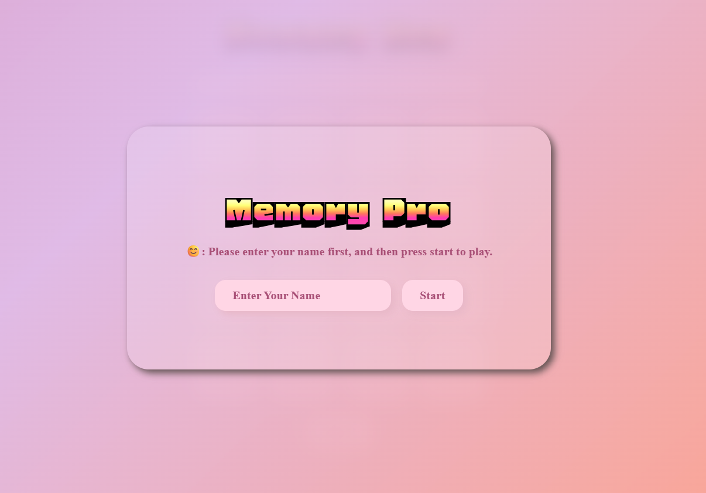
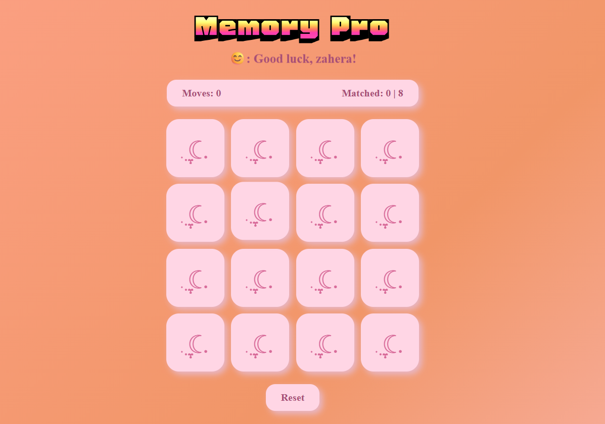
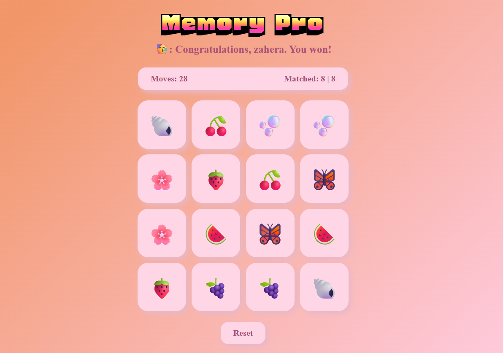

# Memory Pro 🃏✨

## Technologies Used
- HTML
- CSS
- JavaScript
- Git
- GitHub
- Google Fonts

## Description
Memory Pro is a simple card-matching game where players flip over two cards at a time to find matching pairs. The goal is to match all pairs using as few moves as possible while testing your memory and concentration. Built with the *tears* 😭, determination 🫡, and enthusiasm 😁 of a new Software Engineer fellow. This project themed with a sweet, personalized aesthetic, using different emojis to fill the board for infinite experience.

## Features
- Clean and responsive game interface.
- Track player moves.
- Detect matched cards.
- Disply game messages.
- Restart/new Game button.
- Custom cursor.

## Game Play
Follow these simple steps:
1. Open the game in your browser.
2. Click a card to reveal its symbol.
3. Click a second card.
4. If the cards match, they remain face up.
5. If they do not match, they flip back over after a short delay.
6. Continue until all pairs have been matched.
7. Congratulations, **you win!** 🥳

## User Stories
- As a player, I want to see a clear and easy to use game interface.
- As a player, I want to start with all cards face down.
- As a player, I want to be able to click two cards to flip them over.
- As a player, I want the matched cards to remain face up.
- As a player, I want the wrong cards to flip back after a short delay.
- As a player, I want to keep track of my moves.
- As a player, I want to know when I matched all the cards.
- As a player, I want to know when I win.
- As a player, I want the option to restart the game at any point.

## Screenshots
📸 **Start Screen:**

📸 **Game Board:**

📸 **Winning Screen:**

## Future Enhancements
Some enhancement ideas that I may consider to add in the future:
- Multiple levels with different difficulty.
- A timer.
- Hearts for lives.
- Best score leaderboard.
- Sound effect and background music.
- Card flip animation.
- Multiplayer mode.
- Dark mode.
- Different card themes.

## Credits
Developed by **Zahera S.** for General Assembly - Bahrain, Software Engeneering Bootcamp, First Project.

Special thanks to:

> #### "You guys are doing great..."

— *Omar's daily motivational speech* 😊

Also, a huge thank you to Zahraa, Zaid, and Israa for always being ready to help!

God bless you all ❤️

## License
This project is open source. You are welcome to view, study, use, modify, and distribute the project for personal, educational, or commercial purposes, provided that appropriate credit is given to the original author.
